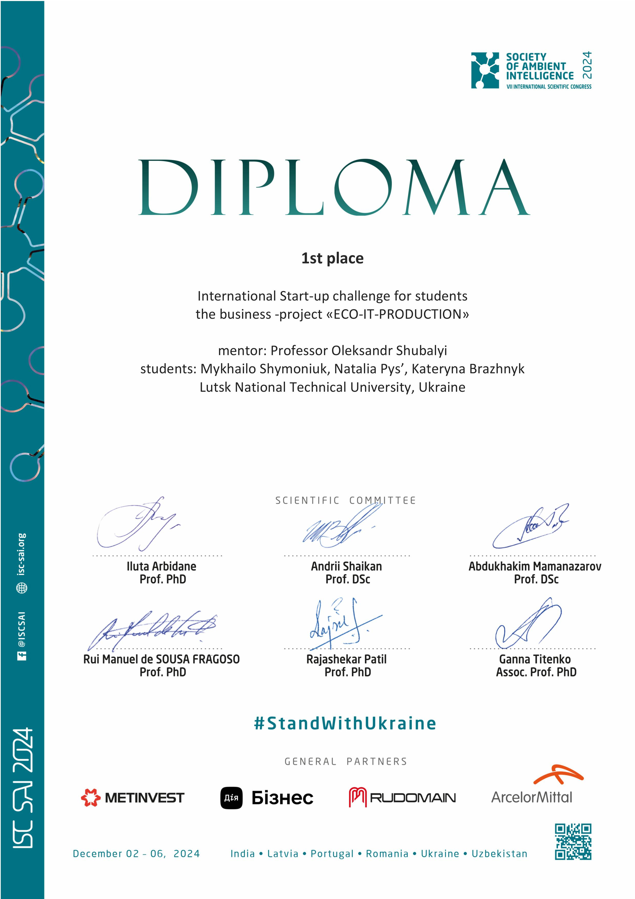

## TEAM:
- [Shymonyuk Mykhailo](https://github.com/M1XaLik)
- [Natalia Pys'](https://github.com/bubick123)
- [Brazhnyk Kateryna](https://github.com/CHARDETT)

# Українська:

Проєкт був зібраний за кілька днів на колінці, тут немає ніякої магії, оптимізації, до речі, теж. 🙂

### Розгортання

Для розгортання ресурсу потрібно замінити значення портів та токенів у файлах `.env`, що знаходяться у кореневих папках як сервера, так і клієнта (це той самий MongoDB токен, Mapbox токен та IP-адреси вебдодатків).

### Мета

Метою було створення функціонального прототипу. Проект виграв перше місце на VII INTERNATIONAL SCIENTIFIC CONGRESS “SOCIETY OF AMBIENT INTELLIGENCE 2024” AND INTERNATIONAL START-UP CHALLENGE FOR STUDENTS. Цей додаток призначений для нанесення на карту точок (за допомогою вводу адреси) і обчислення оптимального маршруту між ними.

---

# English:

The project was put together in a few days on the fly, so there's no magic or optimization here, by the way, either. 🙂

### Deployment

To deploy the resource, you need to replace the port and token values in the `.env` files located in the root directories of both the server and the client (this includes MongoDB token, Mapbox token, and the IP addresses of the web applications).

### Purpose

The purpose was to create a functional prototype. The project won first place at the VII INTERNATIONAL SCIENTIFIC CONGRESS “SOCIETY OF AMBIENT INTELLIGENCE 2024” AND INTERNATIONAL START-UP CHALLENGE FOR STUDENTS. This application is designed to plot points on a map (by entering addresses) and calculate the optimal route between them.
